# System Architecture & Design Specification

## 1. Project Overview

**CO-PO Attainment and Accreditation Management System (Outcome360)** is an academic outcome management platform designed for higher education institutions practicing **Outcome-Based Education (OBE)**.

The platform streamlines the end-to-end outcome measurement lifecycle:
1. Defining academic structures (Departments, Programs, Courses).
2. Formulating Course Outcomes (COs) and Program Outcomes (POs).
3. Establishing quantitative CO-PO correlation mappings (levels 1, 2, 3).
4. Tracking student assessments (continuous internal evaluations, semester examinations, assignments).
5. Calculating direct and indirect CO attainment and subsequent PO/PSO attainment.
6. Aggregating accreditation metrics, compliance tracking, and automated report generation (e.g., NBA SSR, NAAC criteria).

---

## 2. Technology Stack

- **Core Framework:** [Next.js 16 (App Router)](https://nextjs.org/)
- **UI Library:** [React 19](https://react.dev/) (Functional Components, Hooks, strict immutability)
- **Language:** [TypeScript 5](https://www.typescriptlang.org/) (Static type checking and domain interfaces)
- **Styling Engine:** [Tailwind CSS v4](https://tailwindcss.com/) with CSS variables
- **Iconography:** [Lucide React](https://lucide.dev/)
- **State Management:** React Local & Lifted State (`useState`, `useCallback`, `useMemo`), unidirectional data flow
- **Service Layer:** Decoupled asynchronous service abstraction (`src/services/`) backed by domain data models
- **Planned Backend Integration:** Next.js Route Handlers (`src/app/api/`) and Mongoose/MongoDB persistence (`src/models/`)

---

## 3. High-Level Architecture Diagram

The diagram below illustrates the end-to-end architecture of Outcome360, showing the relationship between actors, presentation layers, component abstractions, service layer, and planned backend persistence:

```mermaid
flowchart TD
    subgraph Actors["User Roles"]
        Admin["Admin User"]
        Faculty["Faculty Member"]
        HOD["HOD / Coordinator"]
        Accreditation["Accreditation / Management"]
    end

    subgraph Frontend["Next.js 16 / React 19 Frontend"]
        subgraph LayoutLayer["Application Layout"]
            Layout["DashboardLayout"]
            Sidebar["Sidebar Navigation"]
            Navbar["Top Header & Profile"]
            Layout --> Sidebar
            Layout --> Navbar
        end

        subgraph PageLayer["App Router Pages (src/app/)"]
            P_Dash["/dashboard"]
            P_Course["/courses"]
            P_CO["/course-outcomes"]
            P_PO["/program-outcomes"]
            P_Map["/co-po-mapping"]
            P_Attain["/co-attainment"]
            P_Report["/reports"]
        end

        subgraph ComponentLayer["Reusable Functional Components (src/components/)"]
            C_KPI["KPICard & AttainmentSummary"]
            C_Course["CourseList & CourseForm"]
            C_Outcomes["COList, COCard & POList"]
            C_Map["MappingTable Matrix"]
            C_Attain["AttainmentTable & AttainmentChart"]
            C_Report["ReportTable & ReportDownload"]
        end

        subgraph StateLayer["Client State & Props (Immutable)"]
            State["Local Component State<br/>(useState / Props / Callbacks)"]
        end
    end

    subgraph ServiceLayer["Service Abstraction Layer (src/services/)"]
        S_Course["courseService.ts"]
        S_Outcome["outcomeService.ts"]
        S_Attain["attainmentService.ts"]
    end

    subgraph BackendLayer["Planned Backend & Persistence"]
        API["Next.js Route Handlers (src/app/api/)"]
        Models["Mongoose Schemas (src/models/)"]
        DB[(MongoDB Database)]
    end

    %% Connections
    Actors --> LayoutLayer
    LayoutLayer --> PageLayer
    PageLayer --> ComponentLayer
    ComponentLayer --> StateLayer
    StateLayer --> ServiceLayer
    ServiceLayer -.->|"Future API Handshake"| API
    API -.-> Models
    Models -.-> DB
```



---

## 4. Component Hierarchy & Decomposition

To ensure modularity and avoid monolithic components, the interface is decomposed into discrete, single-responsibility functional components:

```text
App (Root Layout: src/app/layout.tsx)
│
├── DashboardLayout (src/app/(dashboard)/layout.tsx)
│   ├── Sidebar (src/components/layout/Sidebar.tsx)
│   │   ├── NavItem (Navigation link with active detection)
│   │   └── SectionTitle (Categorical groupings)
│   └── Navbar (src/components/layout/Navbar.tsx)
│       ├── SearchBar (Course/outcome quick search)
│       ├── NotificationBell (Alert counter)
│       └── UserProfileChip (Current role display)
│
├── Dashboard Page (/dashboard)
│   ├── KPICard (src/components/dashboard/KPICard.tsx)
│   ├── AttainmentSummary (src/components/dashboard/AttainmentSummary.tsx)
│   ├── AttainmentTrendChart (src/components/dashboard/AttainmentTrendChart.tsx)
│   └── ActivityFeed (src/components/dashboard/ActivityFeed.tsx)
│
├── Course Management Page (/courses)
│   ├── CourseList (src/components/courses/CourseList.tsx)
│   ├── CourseForm (src/components/courses/CourseForm.tsx)
│   └── CourseDetails (src/components/courses/CourseDetails.tsx)
│
├── Course Outcomes Page (/course-outcomes)
│   ├── COList (src/components/outcomes/COList.tsx)
│   ├── COCard (src/components/outcomes/COCard.tsx)
│   └── COForm (src/components/outcomes/COForm.tsx)
│
├── Program Outcomes Page (/program-outcomes)
│   ├── POList (src/components/outcomes/POList.tsx)
│   └── POForm (src/components/outcomes/POForm.tsx)
│
├── CO-PO Mapping Page (/co-po-mapping)
│   └── MappingTable (src/components/mapping/MappingTable.tsx)
│
├── Attainment Page (/co-attainment)
│   ├── AttainmentTable (src/components/attainment/AttainmentTable.tsx)
│   ├── AttainmentSummary (src/components/attainment/AttainmentSummary.tsx)
│   └── AttainmentChart (src/components/attainment/AttainmentChart.tsx)
│
└── Reports Page (/reports)
    ├── ReportTable (src/components/reports/ReportTable.tsx)
    └── ReportDownload (src/components/reports/ReportDownload.tsx)
```

---

## 5. Component Responsibilities & Interface Contracts

| Component | Responsibility | Parent Component | Child Components | Data Received (Props) | State Managed |
| :--- | :--- | :--- | :--- | :--- | :--- |
| **`DashboardLayout`** | Overall shell; renders sidebar, top navbar, and content container | `src/app/layout.tsx` | `Sidebar`, `Navbar`, `{children}` | `children: ReactNode` | None |
| **`Sidebar`** | Navigation across modules with active route indicator | `DashboardLayout` | `NavItem`, `SectionTitle` | None | Active route (via `usePathname`) |
| **`Navbar`** | Global search, notifications, active role indicator | `DashboardLayout` | None | Current user info | None |
| **`KPICard`** | Displays single metric with icon, value, change indicator | `DashboardPage` | None | `title`, `value`, `change`, `icon`, `color` | None (pure presentational) |
| **`AttainmentTrendChart`** | Visual representation of departmental PO attainment | `DashboardPage` | None | `departments`, `selectedTimeframe` | Selected filter timeframe |
| **`ActivityFeed`** | Action items and recent accreditation events | `DashboardPage` | None | `activities` | None |
| **`CourseList`** | Render course catalog cards with filters | `CoursesPage` | `CourseCard` | `courses`, `onSelectCourse`, `selectedCourseId` | Filter query, department filter |
| **`CourseForm`** | Create new course entry with validation | `CoursesPage` | None | `onSubmit(courseData)`, `onCancel` | Form inputs (code, name, credits) |
| **`CourseDetails`** | Detailed view of selected course, faculty, and linked outcomes | `CoursesPage` | None | `course` | None |
| **`COList`** | Display list of Course Outcomes for a selected course | `CourseOutcomesPage` | `COCard` | `cos`, `selectedCourseId`, `onDeleteCO` | None |
| **`COCard`** | Card displaying CO code, statement, Bloom's taxonomy level | `COList` | None | `co`, `onEdit` | None |
| **`COForm`** | Input form for defining/updating a Course Outcome | `CourseOutcomesPage` | None | `onSubmit(coData)`, `courseId` | CO form inputs (code, text, bloomLevel, target) |
| **`POList`** | Render standard PO1-PO12 graduate attributes | `ProgramOutcomesPage` | None | `pos` | Selected PO filter |
| **`MappingTable`** | Interactive $M \times N$ matrix for CO-PO correlation values | `COPOMappingPage` | None | `courseId`, `cos`, `pos`, `mappings`, `onUpdateMapping` | Local editing cell status |
| **`AttainmentTable`** | Breakdown of direct, indirect, and overall attainment per CO | `COAttainmentPage` | None | `attainmentData` | Filter thresholds |
| **`AttainmentChart`** | Bar visualization of Target % vs Attained % per CO | `COAttainmentPage` | None | `attainmentData` | None |
| **`ReportTable`** | Accreditation report manifest with export actions | `ReportsPage` | `ReportDownload` | `reports`, `onDownload` | Category filter |
| **`ReportDownload`** | Export action button trigger | `ReportTable` | None | `reportId`, `format`, `onExport` | Export progress state |

---

## 6. Actual Repository Structure

```text
CO-PO-Attainment-and-Accreditation-Management/
├── docs/                               # Architecture, Data Model, and Workflow specifications
│   ├── architecture.md                 # System architecture, component tree, and design decisions
│   ├── data-model.md                   # Core entities, fields, relationships, and ER diagram
│   └── workflow.md                     # Role-based workflows and primary OBE lifecycle sequence
├── public/                             # Static assets and SVGs
├── src/
│   ├── app/                            # Next.js App Router root
│   │   ├── (auth)/
│   │   │   └── login/page.tsx          # Login stub (auth placeholder for future phase)
│   │   ├── (dashboard)/                # Main authenticated application route group
│   │   │   ├── layout.tsx              # Shell layout composing Sidebar and Navbar
│   │   │   ├── dashboard/page.tsx      # Dashboard view (KPIs, Charts, Activity)
│   │   │   ├── courses/page.tsx        # Course management view
│   │   │   ├── course-outcomes/page.tsx# CO formulation view
│   │   │   ├── program-outcomes/page.tsx# PO catalog view
│   │   │   ├── co-po-mapping/page.tsx  # CO-PO mapping matrix view
│   │   │   ├── co-attainment/page.tsx  # Attainment calculation view
│   │   │   ├── reports/page.tsx        # Accreditation reports view
│   │   │   └── ...                     # Additional route stubs (assessments, users, settings)
│   │   ├── api/                        # Next.js route handlers (backend stubs)
│   │   ├── globals.css                 # Tailwind CSS v4 design tokens and utilities
│   │   ├── layout.tsx                  # Global HTML wrapper
│   │   └── page.tsx                    # Root redirect to /dashboard
│   ├── components/                     # Reusable functional React components
│   │   ├── layout/                     # Sidebar, Navbar, PageHeader
│   │   ├── dashboard/                  # KPICard, AttainmentSummary, AttainmentTrendChart, ActivityFeed
│   │   ├── courses/                    # CourseList, CourseForm, CourseDetails
│   │   ├── outcomes/                   # COList, COCard, COForm, POList, POForm
│   │   ├── mapping/                    # MappingTable (correlation matrix)
│   │   ├── attainment/                 # AttainmentTable, AttainmentChart
│   │   └── reports/                    # ReportTable, ReportDownload
│   ├── data/                           # Realistic seed / mock datasets
│   │   └── mockData.ts                 # Strongly-typed OBE datasets for local execution
│   ├── models/                         # Mongoose ODM domain schemas (planned persistence)
│   │   ├── User.ts, Course.ts, CO.ts, PO.ts, COPOMap.ts, Assessment.ts, ...
│   ├── services/                       # Asynchronous service layer abstraction
│   │   ├── courseService.ts            # Course and department data operations
│   │   ├── outcomeService.ts           # CO, PO, and CO-PO mapping operations
│   │   └── attainmentService.ts        # Attainment and report data operations
├── package.json                        # Project dependencies and npm scripts
├── tsconfig.json                       # TypeScript compiler configuration
└── README.md                           # Main project documentation and setup guide
```

---

## 7. User Roles & Access Boundaries

The system identifies four primary stakeholder roles:

### 1. Admin
- **Core Responsibilities:**
  - Manages system users (creating accounts, assigning roles).
  - Manages academic departments and degree programs.
  - Maintains institutional academic year calendars and configuration.
  - Oversees system health, audit logs, and global parameters.

### 2. Faculty
- **Core Responsibilities:**
  - Manages assigned courses and curricula.
  - Formulates Course Outcomes (COs) mapped to Bloom's Taxonomy.
  - Enters assessment plans (CIE, Quizzes, Lab, Semester Exams).
  - Inputs student evaluation marks.
  - Defines the CO-PO correlation matrix (levels 1, 2, 3) for assigned courses.
  - Reviews direct CO attainment calculations.

### 3. HOD / Department Coordinator
- **Core Responsibilities:**
  - Reviews and approves course syllabi and CO definitions across the department.
  - Reviews CO-PO mapping matrices for consistency and curriculum alignment.
  - Monitors department-wide CO and PO attainment thresholds.
  - Initiates continuous improvement / corrective action plans for low attainment.
  - Generates departmental OBE performance reports.

### 4. Accreditation / Management
- **Core Responsibilities:**
  - Monitors institutional and program-level attainment trends.
  - Reviews compliance against accreditation criteria (e.g., NBA Criteria 2 & 3, NAAC Criterion 2).
  - Audits supporting academic evidence and course files.
  - Generates and downloads official Self-Study Reports (SSR).

---

## 8. Data-Flow Architecture

The architecture enforces a strict **unidirectional data flow**:

```text
User Interaction (Click / Input)
       │
       ▼
React Component Hierarchy
(Page passes props down to Reusable Components)
       │
       ▼
Local State & Event Handlers
(Controlled components trigger immutable state updates)
       │
       ▼
Service Layer Abstraction (`src/services/`)
(Decoupled async functions returning typed promises)
       │
       ▼
[Current: Mock/Seed Data]  ──► [Future Phase: API Route Handlers (`src/app/api/`)]
                                             │
                                             ▼
                                   [Mongoose Models (`src/models/`)]
                                             │
                                             ▼
                                   [MongoDB Database]
```

### Justification:
- **UI Decoupling:** Components do not fetch directly via hardcoded endpoints; they interact strictly via service interfaces.
- **Seamless Future Backend Transition:** In subsequent sprints, the service methods can be switched from returning in-memory mock promises to calling `fetch('/api/...')` with zero changes required in the React UI components.

---

## 9. State Management & Immutability Approach

### Local State vs Shared State
- **Local State (`useState`):** Kept as close to the leaf node as possible (e.g., form input fields, modal open/close state, dropdown filters).
- **Lifted State:** Managed by parent page components (e.g., `selectedCourseId`, `courses` array, `mappings` matrix) and passed down via props, ensuring a single source of truth.
- **No Heavy Global Stores Needed:** Since each academic workflow is organized by route page, complex global state managers (such as Redux or Zustand) are deliberately omitted for Week 5 to avoid unnecessary boilerplate and cognitive overhead.

### Immutability Enforcement
Direct mutation of React state (e.g., `courses.push(newCourse)` or `mapping[row][col] = val`) is **strictly forbidden**. All state transitions use immutable array and object spreading:

1. **Adding an Item:**
   ```typescript
   setCourses(prevCourses => [...prevCourses, newCourse]);
   ```
2. **Updating an Item:**
   ```typescript
   setCourses(prevCourses =>
     prevCourses.map(course =>
       course.id === updatedCourse.id ? updatedCourse : course
     )
   );
   ```
3. **Updating a 2D Matrix Cell (CO-PO Mapping):**
   ```typescript
   setMappings(prevMappings => ({
     ...prevMappings,
     [`${coId}_${poId}`]: newCorrelationLevel
   }));
   ```
4. **Deleting an Item:**
   ```typescript
   setCOs(prevCOs => prevCOs.filter(co => co.id !== targetCoId));
   ```
