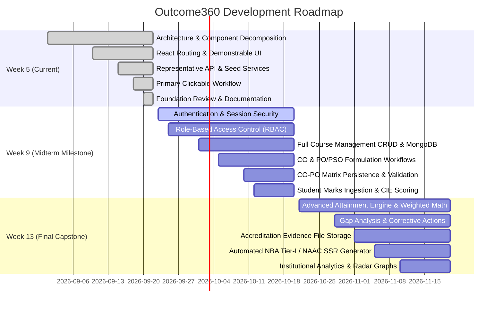

# Development Backlog & Milestone Roadmap

This document outlines the planned future milestones for the **CO-PO Attainment and Accreditation Management System (Outcome360)**.

> [!NOTE]
> **Evaluation Scope Notice:** Features listed below are **planned upcoming work** for Week 9 and Week 13. They are intentionally deferred beyond the Week 5 Foundation Review in strict accordance with the course evaluation milestones.

---

## 1. Milestone Timeline Overview

---

## 2. WEEK 9 — Planned Implementation (Core Platform & Persistence)

The goal of Week 9 is to transition from the Week 5 architecture and mock service layer into a fully dynamic application backed by live MongoDB database models and secure authentication.

### 2.1 Authentication & Role-Based Access Control (RBAC)
- **Planned Work:**
  - Implement NextAuth.js / JWT token-based authentication session flow.
  - Secure `/api/*` route handlers with bearer token validation.
  - Route guards / middleware ensuring users only access authorized pages:
    - *Admin:* User management, Department configuration, Global system settings.
    - *Faculty:* Assigned courses, CO definitions, Student marks, Mapping.
    - *HOD:* Departmental audit views, course approvals, consolidated matrices.
    - *Accreditation Head:* Institutional analytics and SSR document management.

### 2.2 Course & Curriculum Management (Live CRUD)
- **Planned Work:**
  - Connect `src/models/Course.ts` and `src/models/Program.ts` to active MongoDB Atlas instance.
  - Full CRUD operations with server-side validation (Zod schemas).
  - Department and degree program relationship constraints.
  - Excel/CSV batch import for semester course allocations and syllabus documents.

### 2.3 Course Outcomes (CO) & Program Outcomes (PO/PSO) Management
- **Planned Work:**
  - Formal Bloom's Revised Taxonomy cognitive level tagging and verification.
  - Dynamic formulation of Program Specific Outcomes (PSOs) per engineering discipline.
  - Version-controlled Course Outcome history per academic offering year.

### 2.4 CO-PO Mapping Matrix Persistence
- **Planned Work:**
  - Connect `src/models/COPOMap.ts` with compound indexing (`courseId`, `coId`, `poId`).
  - Validation rules preventing orphan mappings or unmapped graduate attributes.
  - Auto-calculation of average correlation coefficients per course and department.

### 2.5 Assessment & Student Marks Management
- **Planned Work:**
  - Create assessment configuration schema (CIE-1, CIE-2, Quizzes, Lab, Semester Exams).
  - Question-level Bloom's and CO mapping (e.g., Question 1a $\rightarrow$ CO1, Question 2 $\rightarrow$ CO3).
  - Student roster upload and marks data entry grid with bulk validation.

---

## 3. WEEK 13 — Planned Implementation (Advanced Analytics & Accreditation SSR)

The goal of Week 13 is to complete the mathematical attainment computation engine, gap analysis workflows, evidence management, and automated report compilation.

### 3.1 Advanced Attainment Computation Engine
- **Planned Work:**
  - Weighted attainment algorithms:
    - Direct Attainment ($80\%$ CIE + SEE).
    - Indirect Attainment ($20\%$ Course Exit Surveys & Student Feedback).
    - Composite CO Attainment Level mapping against NBA Rubric (Level 0, 1, 2, 3).
  - Matrix multiplication derivation:
    $$\text{PO Attainment} = \frac{\sum (\text{CO Attainment} \times \text{Mapping Level})}{\sum \text{Mapping Level}}$$
  - Program Specific Outcome (PSO) attainment computation.

### 3.2 Attainment Gap Analysis & Continuous Improvement (Closing the Loop)
- **Planned Work:**
  - Automatic identification of unmet outcomes ($\text{Attained} < \text{Target}$).
  - Faculty action plan submission portal (corrective pedagogy, tutorial classes, syllabus revision recommendations).
  - HOD review and approval tracker for departmental CQI (Continuous Quality Improvement).

### 3.3 Accreditation Evidence Document Management
- **Planned Work:**
  - Cloud storage integration (AWS S3 / Supabase Storage) for evidence documents.
  - Digital course file binder:
    - Approved Course Syllabus & Calendar.
    - Question Papers with CO-PO mapping scheme.
    - Sample student answer scripts (high, medium, low performers).
    - Rubric evaluation sheets.
  - Compliance tracker against NBA Criterion 2 & Criterion 3 requirements.

### 3.4 Automated SSR & Accreditation Report Generation
- **Planned Work:**
  - Dynamic PDF generation engine (react-pdf / Puppeteer) for NBA Self-Study Report (SSR) Criterion 3.
  - Exportable Excel registers for direct & indirect attainment tables.
  - NAAC AQAR Criterion 2.6 formatted tables and metric calculations.

### 3.5 Executive Analytics & Data Visualization
- **Planned Work:**
  - Interactive radar charts comparing departmental PO attainment against target baselines.
  - Multi-year trend analysis tracking batch-over-batch curriculum improvements.
  - Global activity and audit logging dashboard for accreditation inspection panels.
