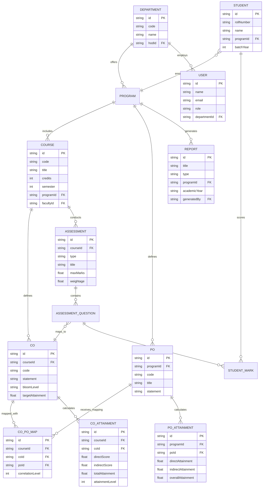

# Core Data Entities & Domain Model

This document specifies the core data entities, their attributes, constraints, and relationships for the **CO-PO Attainment and Accreditation Management System (Outcome360)**.

---

## 1. Entity-Relationship (ER) Diagram

---

## 2. Core Entity Specifications

### 1. User
- **Purpose:** Represents authenticated system stakeholders (Administrators, Faculty members, HODs, and Accreditation team members).
- **Attributes:**
  - `id` (String, PK): Unique identifier.
  - `name` (String): Full name of the user.
  - `email` (String, Unique): Institutional email address used for identification.
  - `role` (Enum): User authorization role (`Admin`, `Faculty`, `HOD`, `Accreditation`).
  - `departmentId` (String, FK): Linked academic department.
  - `isActive` (Boolean): User account active status.
- **Relationships:**
  - Belongs to one `Department`.
  - Can be assigned as instructor to multiple `Courses`.

### 2. Department
- **Purpose:** Represents an academic department within the institution (e.g., Computer Science & Engineering).
- **Attributes:**
  - `id` (String, PK): Unique identifier.
  - `code` (String, Unique): Short department code (e.g., `CSE`, `MECH`).
  - `name` (String): Full department title.
  - `hodId` (String, FK): User ID of the serving Head of Department.
- **Relationships:**
  - Contains multiple `Programs`.
  - Employs multiple `Users` (faculty).

### 3. Course
- **Purpose:** Represents a credit-bearing subject or course offered within an academic program.
- **Attributes:**
  - `id` (String, PK): Unique course identifier.
  - `code` (String, Unique): Official course code (e.g., `CS301`).
  - `title` (String): Course title (e.g., "Data Structures and Algorithms").
  - `credits` (Integer): Credit value (e.g., 3, 4).
  - `semester` (Integer): Academic semester (1 through 8).
  - `academicYear` (String): Offering year (e.g., "2025-2026").
  - `programId` (String, FK): Linked academic degree program.
  - `facultyId` (String, FK): Faculty member responsible for course delivery.
- **Relationships:**
  - Belongs to a `Program`.
  - Taught by a `User` (faculty).
  - Defines 4–6 `Course Outcomes (COs)`.
  - Conducts multiple `Assessments`.
  - Possesses a `CO-PO Mapping` matrix.

### 4. Course Outcome (CO)
- **Purpose:** Articulates measurable knowledge, skills, or behaviors students should demonstrate upon completing a course.
- **Attributes:**
  - `id` (String, PK): Unique CO identifier.
  - `courseId` (String, FK): Reference to parent Course.
  - `code` (String): CO identifier (e.g., `CO1`, `CO2`).
  - `statement` (String): Formal outcome description.
  - `bloomLevel` (Enum): Cognitive domain taxonomy level (`Remember`, `Understand`, `Apply`, `Analyze`, `Evaluate`, `Create`).
  - `targetAttainment` (Float): Target threshold percentage (typically 60% or 70%).
- **Relationships:**
  - Belongs to one `Course`.
  - Mapped to multiple `Program Outcomes (POs)`.
  - Linked to `AssessmentQuestions` for direct measurement.
  - Yields a calculated `COAttainment` record.

### 5. Program Outcome (PO)
- **Purpose:** Represents broad graduate attributes defined by accreditation bodies (e.g., NBA's 12 Graduate Attributes: Engineering Knowledge, Problem Analysis, Design/Development, Modern Tool Usage, etc.).
- **Attributes:**
  - `id` (String, PK): Unique PO identifier.
  - `programId` (String, FK): Reference to the parent Program.
  - `code` (String): Identifier (`PO1` through `PO12`).
  - `title` (String): Short title (e.g., "Problem Analysis").
  - `statement` (String): Comprehensive attribute definition.
- **Relationships:**
  - Belongs to a `Program`.
  - Mapped against multiple `Course Outcomes (COs)`.
  - Aggregates program-level `POAttainment`.

### 6. CO-PO Mapping
- **Purpose:** Quantifies the correlation between a Course Outcome and a Program Outcome on a standardized OBE scale.
- **Attributes:**
  - `id` (String, PK): Unique mapping record ID.
  - `courseId` (String, FK): Linked course.
  - `coId` (String, FK): Linked CO.
  - `poId` (String, FK): Linked PO.
  - `correlationLevel` (Integer): Correlation strength:
    - `0`: No correlation (`-`)
    - `1`: Slight / Low correlation
    - `2`: Moderate / Medium correlation
    - `3`: Substantial / High correlation
  - `justification` (String, Optional): Pedagogical rationale for the mapping score.
- **Relationships:**
  - Connects one `CO` with one `PO` for a specific `Course`.

### 7. Student
- **Purpose:** Represents an enrolled student whose individual performance contributes to outcome attainment.
- **Attributes:**
  - `id` (String, PK): Unique identifier.
  - `rollNumber` (String, Unique): Institutional student registration number.
  - `name` (String): Student's full name.
  - `programId` (String, FK): Enrolled degree program.
  - `batchYear` (Integer): Admission batch year (e.g., 2023).
- **Relationships:**
  - Belongs to a `Program`.
  - Owns multiple `StudentMark` entries across assessments.

### 8. Assessment
- **Purpose:** An evaluation instrument used to measure student learning and CO attainment.
- **Attributes:**
  - `id` (String, PK): Unique assessment ID.
  - `courseId` (String, FK): Course being evaluated.
  - `type` (Enum): `CIE_1` (Midterm 1), `CIE_2`, `Assignment`, `Quiz`, `Lab_Exam`, `Semester_End_Exam`.
  - `title` (String): Assessment name.
  - `maxMarks` (Float): Maximum marks achievable.
  - `weightage` (Float): Percentage contribution to overall course attainment (e.g., 80% Direct CIE + 20% SEE).
- **Relationships:**
  - Belongs to a `Course`.
  - Contains individual questions mapped to specific `COs`.

### 9. CO Attainment
- **Purpose:** Stores the calculated outcome attainment metrics for each Course Outcome.
- **Attributes:**
  - `id` (String, PK): Unique attainment record ID.
  - `courseId` (String, FK): Linked course.
  - `coId` (String, FK): Evaluated Course Outcome.
  - `directScore` (Float): Percentage of students scoring above threshold in direct assessments.
  - `indirectScore` (Float): Attainment percentage derived from Course Exit Surveys.
  - `totalAttainment` (Float): Weighted combination (e.g., $0.8 \times \text{Direct} + 0.2 \times \text{Indirect}$).
  - `attainmentLevel` (Integer): NBA Rubric Level (1, 2, or 3):
    - Level 3: $\ge 70\%$ students score above threshold
    - Level 2: $60\% - 69\%$ students score above threshold
    - Level 1: $50\% - 59\%$ students score above threshold
    - Level 0: $< 50\%$ students
- **Relationships:**
  - Evaluates one `CO` for one `Course`.

### 10. PO Attainment
- **Purpose:** Aggregates program-level outcome attainment derived from CO attainments weighted by the CO-PO correlation matrix.
- **Attributes:**
  - `id` (String, PK): Attainment ID.
  - `programId` (String, FK): Linked academic program.
  - `poId` (String, FK): Linked Program Outcome.
  - `academicYear` (String): Evaluation year.
  - `directAttainment` (Float): Weighted average of mapped course attainments:
    $$\text{PO Attainment} = \frac{\sum (\text{CO Attainment} \times \text{Correlation Level})}{\sum \text{Correlation Level}}$$
  - `indirectAttainment` (Float): Program exit surveys, alumni feedback, employer surveys.
  - `overallAttainment` (Float): Final composite score.
- **Relationships:**
  - Measures one `PO` for an academic `Program`.

### 11. Report
- **Purpose:** Represents generated accreditation documents and compliance summaries.
- **Attributes:**
  - `id` (String, PK): Unique report identifier.
  - `title` (String): Report title (e.g., "NBA Criterion 3 - Course Outcomes and Attainment").
  - `type` (Enum): `NBA_SSR`, `NAAC_SSR`, `CO_PO_MATRIX`, `ATTAINMENT_SUMMARY`.
  - `programId` (String, FK): Program context.
  - `academicYear` (String): Covered academic cycle.
  - `generatedAt` (DateTime): Generation timestamp.
  - `generatedBy` (String, FK): User initiating the report.
- **Relationships:**
  - Produced for a `Program` by an authorized `User`.
