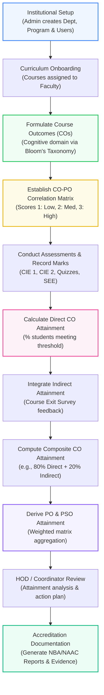

# Product Workflows & OBE Lifecycle

This document describes the operational workflows for each user role in the **CO-PO Attainment and Accreditation Management System (Outcome360)**, along with the end-to-end institutional workflow.

---

## 1. Primary End-to-End OBE Workflow

The core lifecycle connects academic definition, assessment, attainment calculation, and accreditation compliance:



---

## 2. Role-Based Workflows

### 2.1 Faculty Workflow

The faculty member is responsible for operationalizing outcomes for their designated courses:

```text
Login
  │
  ▼
Dashboard
  │
  ▼
Select Course (e.g., CS301 Data Structures)
  │
  ▼
Manage Course Outcomes (COs)
  ├── Define statements (CO1 to CO5)
  ├── Assign Bloom's Taxonomy cognitive levels
  └── Set target attainment thresholds (e.g., 60% students >= 60% marks)
  │
  ▼
CO-PO Mapping Matrix
  ├── Map CO1-CO5 against PO1-PO12
  ├── Assign correlation levels (1 = Low, 2 = Medium, 3 = High, - = None)
  └── Submit mapping for departmental review
  │
  ▼
Assessment & Student Marks
  ├── Map exam questions to specific COs
  └── Enter student marks for internal and external assessments
  │
  ▼
Calculate & Review CO Attainment
  ├── Inspect direct attainment scores
  ├── Review course exit survey results (indirect)
  └── Check target vs. achieved levels
  │
  ▼
Submit Continuous Improvement Notes
  └── Document corrective actions if any CO fails to meet the target
```

---

### 2.2 Head of Department (HOD) / Department Coordinator Workflow

The HOD ensures academic quality, consistency, and curriculum alignment across the department:

```text
Login
  │
  ▼
Dashboard Overview
  ├── Inspect department-wide attainment health metrics
  └── Review pending faculty submissions
  │
  ▼
Review Courses & Syllabi
  ├── Verify coverage of all department degree programs
  └── Audit faculty course outcome formulations
  │
  ▼
Audit CO-PO Mapping Matrices
  ├── Check correlation distribution across courses
  └── Ensure no unmapped critical POs (e.g., PO1, PO2, PO3)
  │
  ▼
Analyze Program Attainment
  ├── Review consolidated PO attainment radar / bar charts
  ├── Identify gap areas where target thresholds are unmet
  └── Review proposed continuous improvement actions from faculty
  │
  ▼
Generate Departmental OBE Reports
  └── Export department attainment summary for academic council
```

---

### 2.3 System Administrator Workflow

The administrator configures institutional metadata, manages user credentials, and maintains system integrity:

```text
Login
  │
  ▼
System Dashboard
  └── Monitor active users, system health, and audit logs
  │
  ▼
Manage Academic Departments
  ├── Create/update departments (e.g., Computer Science, Mechanical)
  └── Assign departmental HODs
  │
  ▼
Manage Academic Programs & Courses
  ├── Define degree programs (e.g., B.Tech CSE, M.Tech AI)
  ├── Upload/create course catalogs per semester
  └── Assign instructors to courses
  │
  ▼
Manage Users & Role Permissions
  ├── Create faculty and coordinator user accounts
  └── Assign specific roles (Admin, Faculty, HOD, Accreditation)
  │
  ▼
System Configuration
  └── Configure academic calendar cycles, grading bands, and NBA thresholds
```

---

### 2.4 Accreditation / Institutional Management Workflow

Accreditation coordinators and senior leadership utilize consolidated analytics to prepare compliance documentation:

```text
Login
  │
  ▼
Accreditation Dashboard
  ├── View overall institutional attainment trends
  └── Track accreditation audit readiness score (e.g., 82% complete)
  │
  ▼
Inspect Program Outcome Attainment
  ├── Review cumulative PO/PSO attainment across multiple graduating batches
  └── Compare target levels vs achieved values for criteria evaluation
  │
  ▼
Review Accreditation Criteria & Evidence
  ├── Audit Criterion 2 (Teaching-Learning Practices)
  ├── Audit Criterion 3 (Course Outcomes and Program Outcomes)
  └── Inspect linked evidence documents (sample exam papers, rubrics, course files)
  │
  ▼
Export Official Compliance Reports
  ├── Generate NBA Self-Study Report (SSR) Criterion 3 tables
  ├── Export NAAC AQAR / SSR outcome attainment registers
  └── Download formatted spreadsheets and PDF executive summaries
```
